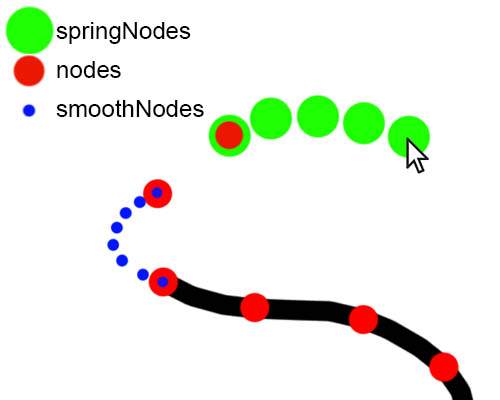
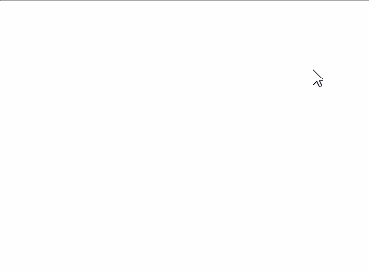
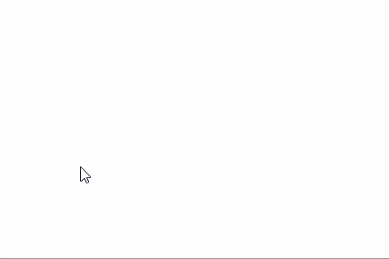

# WickBrush
See it in action: https://wicklets.github.io/WickBrush/

WickBrush is a JavaScript library for creating drawing brushes on HTML canvases.

# Installation

# Quick Start

## Basic Brush
To create a brush, you make an instance of the WickBrush class, which requires an HTML Canvas to draw on:

```javascript
let brush = new WickBrush({
    canvas: canvas
});
```

Now you can draw on your canvas!

## Custom BrushTips
Custom BrushTips in WickBrush are just functions that draw onto an HTML Canvas. Simply import them from `/brushes` and pass them to your brush, or change the `brush.brushTip`:

```javascript
let brush = new WickBrush({
	canvas: canvas,
	brushTip: tireTip,
	});
	
// You can also change the property at any time
brush.brushTip = stampTip
```

# API

Here are all the properties of a Brush. You can change them, or use them in a custom BrushTip function by accessing `brush.property`.

These are all the properties that are computed for you, that are read only:

| property | type | description
|--|--|--|
|`springNodes` | Node[] | the nodes used to smooth the mouse path | read only |
|`node`  | Node | the last node of `springNodes`, good to use as a point to draw at | read only |
|`pNode`  | Node | `node` from the previous draw step, `null` on the first step | read only |
|`nodes`  | Node[] | list of all the `node`s from this stroke, ordered first to last| read only |
|`smoothNodes`  | Node[] | List of nodes that connect `node` from 2 drawing steps ago to `node` from 1 drawing step ago in a smooth path (this is intended to be used to draw a smooth path, as opposed to drawing a straight line from `pNode` to `node`) | read only |
|`pSmoothNodes`  | Node[] | `smoothNodes` from the previous draw step, `null` on the first step | read only |
|`bounds`| {left, right, top, bottom} | A rectangle bound of the current stroke. See [Bounds](#bounds) |

These are all properties you can change. This can happen at any time (continuously updating `pressure` is a common use-case). If you write your own BrushTip functions, you will probably read some of these values too.

| property | type | description | default
|--|--|--|--|
|`canvas` | HTML Canvas | all the nodes' positions are in the canvas' coordinate space, most likely want to draw on the context `canvas.getContext('2d')`| `undefined` |
| `smoothNodesSpacing` | Number | the approximate number of pixels of spacing between consecutive `smoothNodes` | `2` |
| `includeSmoothNodes` | Boolean | Whether or not to calculate the values for `smoothNodes`. If you need super high performance and are not using them, you may want to turn them off. | `true` |
| `interval` | Number | The number of milliseconds between each draw step. | `10` |
| `smoothing` | Number 0-100 | a simple slider to control the smoothness of the brush (setting this actually changes `numSpringNodes` and `tension`, you can set those manually for finer control) | `50` |
| `numSpringNodes` | Number | The number of spring nodes to simulate for the purpose of smoothing the brush path. The more nodes, the more smoothing | `10` |
| `tension` | Number 1-100| The tension of the spring nodes. The higher lower the value, the smoother the path. | `10` |
| `fillStyle` | String | The fill style of the brush. See [HTML fillStyle](https://www.w3schools.com/tags/canvas_fillstyle.asp) | `'0x000000'` |
| `strokeColor` | String | A secondary color, often not set or used in the examples | `'0x000000'` |
| `size` | Number | The size of the brush (in pixels) | `40` |
| `pressure` | Number 0-1 | The brush pressure. It's not set by WickBrush, we recommend using pressure.js to set this value | `1` |
| `debug` | Boolean | If `true`, then some debug displays are drawn on the `debugCanvas` | `false` |
| `debugCanvas` | HTML Canvas | A canvas to draw debug information on, only needed if `debug` is true. It should be placed right on top of `canvas`. `debugCanvas.style.pointerEvents` is set to `'none'` automatically so the mouse events are received by the `canvas`. | `undefined` |
|`catchUp`| Boolean | After the brush is lifted (after `onUp` is called), the brush tip still lags behind the location of the mouse because of the `springNodes`. If `catchUp` is true, then the `springNodes` are used as nodes so that the brush tip catches up to the mouse at the end of the stroke. | `true` |

## Changing Properties

Any property of the brush can be changed at any time. The simplest way to do this is just setting the property directly:

```javascript
brush.fillStyle = '0xFF0000';
brush.tension = 50;
```

### Custom Properties

It doesn't have to be a built-in property, feel free to add custom properties:

```javascript
brush.myProp = 10;
```

If you want the brush to keep track of the value of the property at the previous time step (notice **not** the previous set value, but the previous *used* value at a draw step), then you can use the `brush.change` function. It takes an object as argument:

```javascript
brush.change({
	myProp1: 10,
	myProp2: '0x000000',
});
```

This adds `'myProp1'` and `'myProp2'` to a list of properties that are automatically kept track of. So `'pMyProp1'` and `'pMyProp2` will automatically be set to the values of those properties at the previous draw step (the naming convention that the Brush uses for previous values is to capitalize the first letter of the property, and prepend a 'p').

### Callback Functions

If you want to change properties at specific times in the stroke sequence, you can do so in the following callback functions:

|function| arguments | when it's called |
|--|--|--|
| `onDown` | brush, `'onpointerdown'` event from canvas | when the cursor is pressed down, before any drawing |
| `onDraw` | brush | every draw step, before the drawing occurs |
| `onMove` | brush, `'pointermove'` event from window | every time the cursor is moved while drawing |
| `onUp` | brush, `'pointerup'` event from window | when the cursor is released, note that if `brush.catchUp` is true, then the catch up drawing will occur *after* onUp is called |
| `onStrokeFinished` | brush | At the end of the stroke, after all drawing (including `catchUp` drawing). `brush.bounds` is totally calculated. |

One very common use case is to change the `pressure`. Here's an example using the [pressure.js](https://pressurejs.com/) library:

```javascript
brush.onDown = function() {
	brush.change({pressure: 0});
};

// using pressure.js
Pressure.set(canvas, {
	change: function(force, event) {
		brush.change({pressure: force});
	}
});
```

Note the use of `brush.onDown` in case pressure.js doesn't set the pressure value on the brush before the first draw step.

## How to make a BrushTip
Before we go into how to actually write a BrushTip function, we should first explain the data that you will use to draw with, which are the nodes.

### Understanding Nodes


A Node is just an object with an x and y coordinate. The way the brush works is by dragging a set of nodes (`brush.springNodes`) connected by "springs" behind the mouse. This has the effect of smoothing out the path that the mouse takes (to turn off smoothing, you can set `brush.smoothing = 0`, or `brush.numSpringNodes = 1`, or `brush.tension = 100`). On each drawing step, the end of the chain of `springNodes` is used as a point to draw at. This is called `brush.node`.

To get the previous node, you can access `brush.pNode`. A simple brushTip function might connect `node` and `pNode` with a line:

```javascript
function basicLineTip(brush) {
	let ctx = brush.canvas.getContext('2d');
	ctx.beginPath();
	ctx.moveTo(brush.pNode.x, brush.pNode.y);
	ctx.lineTo(brush.node.x, brush.node.y);
	ctx.stroke();
}
```



One problem with this brush is that it has jagged corners: it would be nicer to achieve a totally smooth path. This smooth path is computed for you and stored in `brush.smoothNodes`. By drawing a circle at each smooth node, we can get a much nicer looking brush stroke:

```javascript
function basicSmoothTip(brush) {
	let ctx = brush.canvas.getContext('2d');
	for (let node of brush.smoothNodes) {
		ctx.beginPath();
		ctx.arc(node.x, node.y, 10, 0, 2 * Math.PI);
		ctx.fill();
	}
}
```



### Writing brushTip functions

Now that you understand the nodes that are available to you, you can start creating your own BrushTips.

The main way to customize your brush is to change the brushTip function. The function takes the WickBrush as an argument (which has the various nodes as properties), and draws on the canvas. A basic circle-tipped brush function looks like this:

```javascript
function circleBrush(brush) {
	let ctx = brush.canvas.getContext('2d');
	ctx.fillStyle = brush.fillColor;
	let r = brush.size * b.pressure / 2;
	let points = brush.smoothNodes;
	for (let pt of points) {
		ctx.beginPath()
		ctx.arc(pt.x, pt.y, r, 0, 2 * Math.PI);
		ctx.fill();
	}
}
```

If you want a square tipped brush instead, you could replace the drawing of the circle with a drawing of a rectangle `ctx.fillRect(pt.x - r, pt.y - r, r*2, r*2)`:


### Bounds
If for some reason you need the bounds of the stroke (we use it in Wick Editor to convert the stroke to an svg), then you can have your BrushTip function return the bounds of what it drew, in the form `{left, right, top, bottom}`, and the brush will expand `brush.bounds` to include that rectangle. If nothing is returned, then `node` is used as the point to include in `bounds`.

# Examples

## Pressure

# Thanks

In developing this library, we took a lot of inspiration from [croquis.js](https://github.com/disjukr/croquis.js), so thanks to them!

# License

MIT License.

Supported by [Wick Editor](https://www.wickeditor.com/).
